# CIFAR-10 Image Classification: PCA+SVM vs. MLP Ensemble vs. CNN

> A comparative study of classical ML and deep learning architectures for image classification, built for COMP4318/5318 (University of Sydney).


## Overview

This project implements and rigorously compares three families of models on the CIFAR-10
dataset (60,000 32×32 colour images across 10 classes):

| Model | Test Accuracy | Weighted F1 |
|---|---:|---:|
| PCA (95% variance) + Linear SVM | 40.4% | 0.39 |
| MLP (best single input, RGB-Pool) | 48.8% | 0.49 |
| **MLP — weighted ensemble (4 inputs)** | **53.5%** | 0.52 |
| **CNN (tuned, 3× Conv2D blocks)** | **74.6%** | 0.74 |

The goal wasn't to chase state-of-the-art numbers, but to justify *why* each architecture
performs the way it does — through systematic hyperparameter tuning, per-class error analysis,
and confusion-matrix diagnostics.

## Sample Data
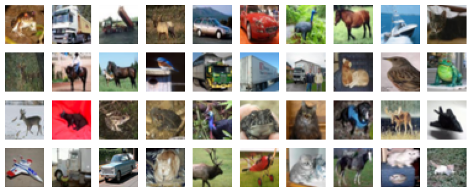

CIFAR-10 is perfectly class-balanced (5,000 training images/class) but presents real challenges:
high intra-class variation (poses, lighting, backgrounds) and strong inter-class similarity
(cat vs. dog, truck vs. automobile, deer vs. horse).

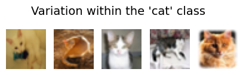
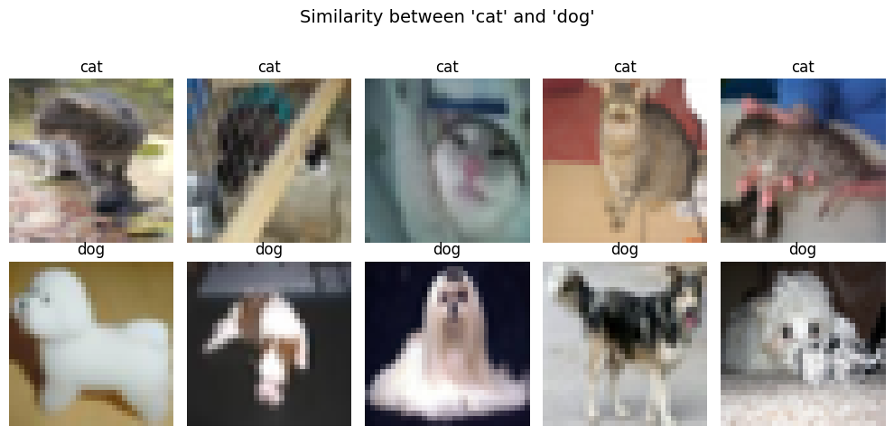

## Methods

### 1. PCA + Linear SVM (classical baseline)
Images flattened to 3,072-dim vectors → PCA (variance-retention target) → one-vs-rest LinearSVC.
Tuned via `GridSearchCV` (3-fold stratified CV) over PCA variance target `{0.80, 0.90, 0.95, 0.99}`
and SVM `C ∈ {0.05, 0.1, 0.5, 1, 5, 10}`.

**Finding:** accuracy is representation-limited, not margin-limited — performance is driven almost
entirely by the PCA variance target (peaking at 0.95 → 216 components), while `C` has negligible
effect once the representation is fixed.

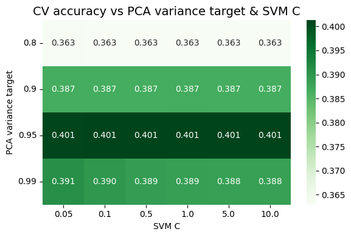
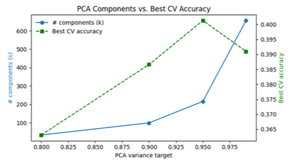

### 2. Multilayer Perceptron (MLP)
Four input representations tested — RGB (32×32), RGB pooled (16×16), HSL (32×32), HSL pooled
(16×16) — each across 28 hyperparameter combinations (activation, layer widths, batch size) in a
two-phase tuning process (short screening → extended 50-epoch training). The four best models
were then combined via **weighted ensembling** based on per-class validation accuracy.

**Finding:** Leaky ReLU with two hidden layers (128→32) consistently won; 2×2 mean pooling
improved generalisation without adding runtime; the weighted ensemble (53.5%) beat every
individual configuration.

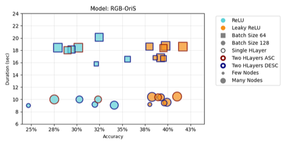
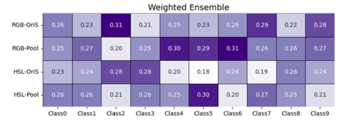

### 3. Convolutional Neural Network (CNN)
Three Conv2D + MaxPooling blocks (32→64→64 filters in the baseline, tuned to 96→128→160) followed
by a 1024-unit dense layer and softmax output. Tuned via **random search** (15 trials) over L2
regularisation, dropout, filter counts, batch size, and learning rate — chosen over grid search for
faster convergence to good configurations (Bergstra & Bengio, 2012).

**Best configuration:** 96–128–160 filters, dropout 0.3, L2 ≈ 1.9×10⁻⁵, learning rate 0.001,
batch size 64 → **74.4% validation accuracy**.

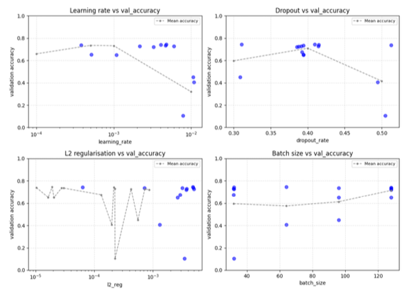
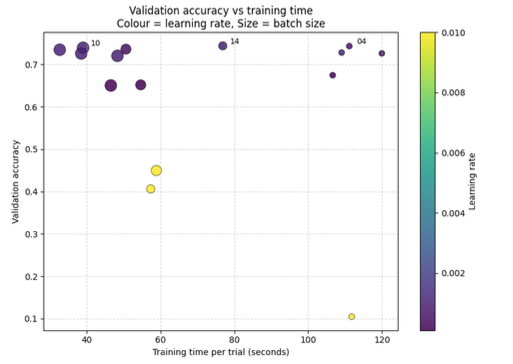

## Results

### Final test performance
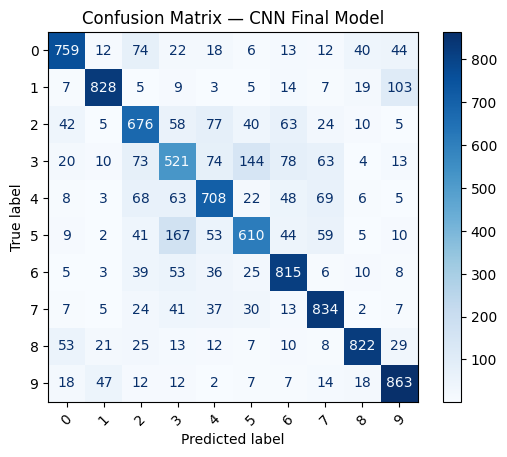

The CNN achieved **74.36% test accuracy**, macro-F1 of 0.7429, and macro-averaged **ROC-AUC of
0.962**. Vehicle classes (automobile, ship, truck) scored highest (precision/recall ≥ 0.82) thanks
to well-defined global shapes; fine-grained animal classes (cat, dog) scored lowest (F1 ≈ 0.53–0.64)
due to high intra-class variation and inter-class overlap.

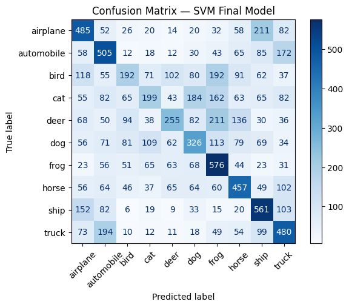

The linear SVM's confusion matrix tells a consistent story: its errors cluster exactly where global
colour/shape cues fail — airplane→ship (0.211), deer→frog (0.211), cat→dog (0.184) — because a
linear model on flattened pixels has no spatial inductive bias.

### Model comparison

| | Modelling Time | Accuracy | Best Class | Worst Class |
|---|---:|---:|---|---|
| PCA + Linear SVM | 36s | 40.4% | Frog (58%) | Bird (19%) |
| MLP (single, RGB-Pool) | 133s | 48.8% | Horse (61%) | Cat (23%) |
| MLP (weighted ensemble) | 428s | 53.5% | Truck (71%) | Cat (32%) |
| **CNN (tuned)** | **65s** | **74.6%** | **Ship (86%)** | **Cat (55%)** |

**Performance ranking:** CNN > MLP ensemble > MLP single > Linear SVM — matching theoretical
expectations. Spatially-aware convolutional filters consistently outperform models that discard
spatial structure by flattening pixels. Notably, the CNN is also the *fastest* of the three to run
at final training time, despite being the most complex architecture to tune.

## Repository structure
```
├── notebook.ipynb              # Main analysis notebook (code)
├── report.pdf                  # Full written report
├── Assignment2Data/            # Not included — see Data section
├── assets/                     # README images (see list below)
├── figs/                       # Notebook-generated plots
├── cnn_random_search/          # Keras Tuner search results (generated)
├── requirements.txt
└── README.md
```

## Data
The dataset is a CIFAR-10 subset provided as `.npy` files, expected at:
```
./Assignment2Data/X_train.npy
./Assignment2Data/y_train.npy
./Assignment2Data/X_test.npy
./Assignment2Data/y_test.npy
```
Shapes: `X_train (50000, 32, 32, 3)`, `y_train (50000,)`, `X_test (10000, 32, 32, 3)`,
`y_test (10000,)`. This coursework-provided data is **not included** in this repository.

## Setup
```bash
python3 -m venv venv
source venv/bin/activate     # Windows: venv\Scripts\activate
pip install -r requirements.txt
```
Requires Python 3.12.

## Usage
1. Place the four `.npy` data files in `Assignment2Data/`.
2. Launch Jupyter and run the notebook top to bottom:
   ```bash
   jupyter notebook notebook.ipynb
   ```
3. Section 4 ("Final models") trains each model independently with its best hyperparameters
   and does not depend on the tuning cells having been run first — this is the fastest path
   to reproducing final results.

## Key takeaways
- **Representation matters more than the classifier** for the PCA+SVM pipeline — accuracy tracked
  the PCA variance target almost perfectly, with the SVM's `C` parameter making little difference.
- **Pooling helped the MLP, not because of runtime savings**, but because it reduced pixel-level
  noise — training time was dominated by backpropagation cost, not input size.
- **CNNs win decisively on image data** because convolution preserves the 2D spatial structure that
  flattening destroys — reflected in the CNN's near-doubling of accuracy over the best MLP ensemble.
- **All three models struggle on the same classes** (cat, bird, dog) — a signal that these
  confusions are a property of the *dataset's* fine-grained/texture-heavy classes, not a specific
  architecture's weakness.

## Future work
- PCA+SVM: richer features (HOG, HSV histograms) instead of raw flattened pixels.
- MLP: spatial/positional encodings, dropout/batch normalisation to curb overfitting.
- CNN: early stopping, data augmentation, learning rate scheduling, batch normalisation,
  residual connections.

## Authors
Group 2 — COMP4318/5318, University of Sydney

## Acknowledgements
CNN architecture adapted from Ajala, S. (2021), *Convolutional Neural Network Implementation for
Image Classification using CIFAR-10 Dataset*, ResearchGate. Full reference list in `report.pdf`.
Artificial intelligence tools (ChatGPT, Gemini) were used to help structure code and refine writing.

## License
MIT — see [choosealicense.com](https://choosealicense.com/) if you'd like a different license.